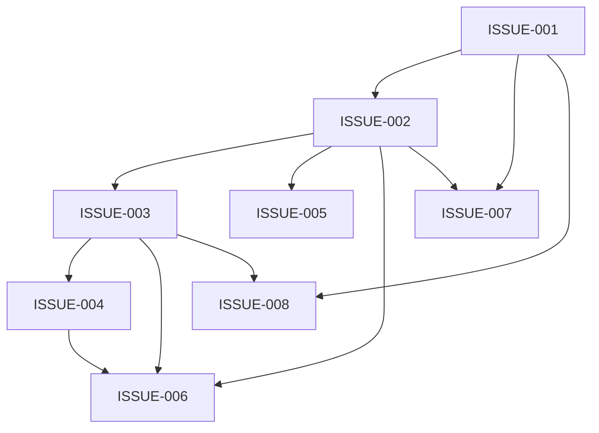

# Issues — Expense Reimbursement Portal

## Dependency graph

## Foundation

### ISSUE-001: Workday org-hierarchy sync
**Slice:** The system can resolve any employee's profile, manager, VP, and department from a locally-cached daily snapshot of Workday — without coupling live request paths to Workday availability.
**Depends on:** none
**Touches:** WorkdayIntegration

#### Acceptance criteria
- [ ] Daily sync job fetches employee, manager, and VP relationships from Workday and upserts into `employee_snapshots`
- [ ] `ResolveEmployee(employeeId)` returns `EmployeeProfile` (name, email, department, manager, VP chain) from the local snapshot
- [ ] `ResolveApproverChain(employeeId)` returns the correct manager and VP for a given employee
- [ ] `ResolveDepartment(employeeId)` returns the correct department identifier
- [ ] Portal remains operational when Workday is unreachable; stale snapshot is used as fallback
- [ ] UI surfaces a staleness warning after the snapshot has not refreshed for more than 24 hours
- [ ] Sync failure is logged to Serilog and emits an OpenTelemetry alert

#### Out of scope
- Bidirectional sync or write-back to Workday
- Real-time Workday webhook integration (daily batch is sufficient)

#### Source
- §WorkdayIntegration (tech design)
- §Integration points — Workday (tech design)
- §NFRs — Workday degradation (tech design)

---

## Vertical slices

### ISSUE-002: Claim submission with auto-approval and currency capture
**Slice:** An employee submits an expense claim with line items, receipts, and currency selection; the system records an immutable exchange rate, routes the claim, and auto-approves it if under £500 — the full submission path fires end-to-end.
**Depends on:** ISSUE-001
**Touches:** ClaimSubmission, AuditLog

#### Acceptance criteria
- [ ] Employee selects currency (GBP or EUR) at submission
- [ ] System fetches and records the ECB GBP-equivalent exchange rate immutably at the moment of submission
- [ ] Exchange rate is visible on the claim record and cannot be edited after submission
- [ ] Claims under £500 (GBP-equivalent) move to "Approved" status without manual intervention
- [ ] Claims £500–£5,000 enter "Pending Manager Approval" status
- [ ] Claims over £5,000 enter "Pending Manager Approval" status (VP approval required after manager approves)
- [ ] Threshold routing logic is reflected in the claim status shown to the employee and in the audit log
- [ ] `POST /claims` returns 201 with `claimId`, `status`, and `exchangeRateToGbp`
- [ ] `POST /receipts/upload` accepts multipart form data and returns a `receiptId`
- [ ] `GET /claims/{claimId}` returns full `ClaimDetail` including line items, receipts, exchange rate, and current status
- [ ] `GET /claims` returns paginated `ClaimSummary` list filtered by `employeeId` and `status`
- [ ] Submission event is written to the audit log with actor, timestamp, and event type
- [ ] If ECB is unreachable at submission time, the previous day's cached rate is used and a warning is logged

#### Out of scope
- VP approval tier (handled in ISSUE-003)
- Rejection and resubmission (handled in ISSUE-004)
- Payment status update (handled in ISSUE-005)

#### Source
- FR-001 (requirements) — threshold routing and auto-approval
- FR-002 (requirements) — multi-currency and immutable exchange rate
- §ClaimSubmission (tech design)
- §Key flows — Claim submission (tech design)
- §API contracts — ClaimSubmission public surface (tech design)
- §NFRs — Exchange rate freshness (tech design)

---

### ISSUE-003: Manager and VP approval workflow
**Slice:** A manager can approve or reject a pending claim with an optional comment; VP approval is triggered for claims over £5,000 after manager sign-off — the full approval decision path is demoable.
**Depends on:** ISSUE-001, ISSUE-002
**Touches:** ApprovalWorkflow, AuditLog, ClaimSubmission

#### Acceptance criteria
- [ ] Approver can call `POST /claims/{claimId}/approve` to approve a claim in an approvable state
- [ ] Approver can call `POST /claims/{claimId}/reject` with an optional comment to reject a claim
- [ ] Manager-approved claims under £5,000 move to "Approved" status
- [ ] Manager-approved claims over £5,000 move to "Pending VP Approval" status; VP must then approve
- [ ] VP-approved claims move to "Approved" status
- [ ] Approving or rejecting a claim in the wrong tier or wrong state returns 409
- [ ] Approval and rejection events are written to the audit log with approver id, timestamp, and comment (if any)
- [ ] Rejection comment is visible to the employee and to Finance via the audit trail
- [ ] Approver identity and tier are resolved via WorkdayIntegration

#### Out of scope
- Resubmission after rejection (handled in ISSUE-004)
- Employee notification delivery (email/push — deferred outside portal scope)

#### Source
- FR-001 (requirements) — manager and VP approval tiers
- FR-003 (requirements) — approval/rejection with comments
- §ApprovalWorkflow (tech design)
- §Key flows — Manager approval / rejection (tech design)
- §API contracts — ApprovalWorkflow public surface (tech design)

---

### ISSUE-004: Rejection, resubmission, and version history
**Slice:** An employee can edit a rejected claim and resubmit it; the system creates a new claim version, resets the approval workflow, and preserves the full version lineage — the edit-and-resubmit loop is demoable end-to-end.
**Depends on:** ISSUE-003
**Touches:** ApprovalWorkflow, ClaimSubmission, AuditLog

#### Acceptance criteria
- [ ] Rejected claim status changes to "Rejected" with the rejection reason visible to the employee
- [ ] Employee can edit a rejected claim and call `POST /claims/{claimId}/resubmit` with updated line items and receipts
- [ ] Resubmission creates a new claim version (new `claimId` linked via `parent_claim_id`); original version is preserved unchanged
- [ ] Each resubmission increments `version_number` and resets the approval workflow from the beginning
- [ ] `GET /claims/{claimId}/versions` returns the complete version history with status and rejection comment for each version
- [ ] Version history is visible to both the employee and Finance
- [ ] Resubmission event is written to the audit log
- [ ] Attempting to resubmit a claim not in Rejected state returns 409

#### Out of scope
- Diff or visual comparison between versions
- Automated policy violation detection on resubmission

#### Source
- FR-004 (requirements) — rejection, resubmission, version history
- §ApprovalWorkflow — `ResubmitClaim`, `GetVersionHistory` (tech design)
- §Data model — `claims.parent_claim_id`, `claims.version_number` (tech design)
- §Key flows — Manager approval / rejection (tech design)

---

### ISSUE-005: Payment status tracking
**Slice:** Finance can mark an approved claim as Paid and record the payment timestamp; employees see their claim's current lifecycle status in real time — the full Submitted → Approved → Paid progression is demoable.
**Depends on:** ISSUE-002
**Touches:** ClaimSubmission

#### Acceptance criteria
- [ ] Claim displays current status: Submitted, Approved, Paid, or Rejected
- [ ] `PATCH /claims/{claimId}/status` with `{ status: "Paid", paidAt }` moves the claim to Paid status (Finance role only)
- [ ] Non-Finance callers receive 403 when attempting to mark a claim Paid
- [ ] Status updates are reflected in `GET /claims/{claimId}` within the same request cycle (no eventual consistency lag for the employee-visible status)
- [ ] Employees can view status for their own claims; Finance can view status for all claims
- [ ] Payment event is written to the audit log with actor and timestamp

#### Out of scope
- Actual payment execution or General Ledger integration (Finance initiates payment in downstream system; portal tracks status only)
- Automated payment triggers

#### Source
- FR-005 (requirements) — payment status tracking
- §ClaimSubmission — `RecordPayment` (tech design)
- §API contracts — `PATCH /claims/{claimId}/status` (tech design)
- §Constraints register — C-005 (no GL integration) (tech design)

---

### ISSUE-006: Audit log with role-based visibility
**Slice:** Any authorised user can query the audit log for claim state transitions; Finance sees all events, managers see their team's events, and employees see only their own — the scoped visibility is demoable in a single query.
**Depends on:** ISSUE-002, ISSUE-003, ISSUE-004
**Touches:** AuditLog, WorkdayIntegration

#### Acceptance criteria
- [ ] All state transitions are logged: submission, approval, rejection, resubmission, payment
- [ ] Each audit event includes actor id, timestamp, event type, and reason (where applicable)
- [ ] Finance can query `GET /audit` and receive events for all claims
- [ ] Managers can query `GET /audit` and receive events only for their team's claims
- [ ] Employees can query `GET /audit` and receive events only for their own claims
- [ ] Role scoping is enforced server-side; the response set is filtered before returning to the caller
- [ ] A requester with no matching visible records receives 403
- [ ] Audit events table is insert-only; no UPDATE or DELETE is ever issued against it

#### Out of scope
- Real-time audit event streaming or webhooks
- Audit log export to CSV (Finance reporting handled in ISSUE-007)

#### Source
- FR-006 (requirements) — audit log with role-based visibility
- §AuditLog (tech design)
- §Key flows — Audit log query (tech design)
- §API contracts — AuditLog public surface (tech design)
- §Data model — `audit_events` insert-only constraint (tech design)

---

### ISSUE-007: Spend reporting by department and category
**Slice:** A Finance user can generate and export a monthly spend report grouped by department or expense category — the full query-to-CSV export flow is demoable.
**Depends on:** ISSUE-001, ISSUE-002
**Touches:** Reporting, WorkdayIntegration, ClaimSubmission

#### Acceptance criteria
- [ ] Finance can call `GET /reports/spend` with `from`, `to` (YYYY-MM), and `groupBy=department|category` parameters
- [ ] Report returns total GBP spend and claim count per group for the requested date range
- [ ] Report sums include all claims in Approved or Paid status within the period
- [ ] Requesting with `Accept: text/csv` returns a downloadable CSV export
- [ ] Non-Finance callers receive 403
- [ ] Department grouping uses the org hierarchy from WorkdayIntegration
- [ ] Report is accurate: totals match the sum of individual claim `total_amount_gbp` values for the filtered set

#### Out of scope
- Scheduled or emailed reports
- Reports for non-Finance roles
- Predictive or trend analytics

#### Source
- FR-007 (requirements) — spend reporting by department and category
- §Reporting — `GenerateSpendReport` (tech design)
- §API contracts — Reporting public surface (tech design)
- §Data model — indexes on `claims(submitted_at, status)` for date-range scans (tech design)

---

### ISSUE-008: Manager pending-approvals dashboard
**Slice:** A manager can view a filtered, sortable list of all team claims awaiting their approval and drill into any claim's details without leaving the dashboard — the full dashboard interaction is demoable.
**Depends on:** ISSUE-001, ISSUE-003
**Touches:** Reporting, WorkdayIntegration, ApprovalWorkflow

#### Acceptance criteria
- [ ] Manager dashboard displays all team claims in "Pending Manager Approval" or "Pending VP Approval" state
- [ ] Each row shows: claim amount (GBP), employee name, expense category, and submission date
- [ ] Manager can filter by status and sort by amount or submission date (asc/desc)
- [ ] Manager can click a row to view full claim details without navigating away from the dashboard
- [ ] `GET /dashboard/pending-approvals` returns paginated `PendingClaimSummary` list scoped to the manager's team
- [ ] Non-manager callers receive 403
- [ ] Dashboard uses `GetPendingApprovalsForManager(managerId, filters)` from the Reporting component

#### Out of scope
- Approval action directly from the dashboard (manager navigates to claim detail to approve/reject)
- Cross-team or organisation-wide approval views

#### Source
- FR-008 (requirements) — manager dashboard for pending approvals
- §Reporting — `GetPendingApprovalsForManager` (tech design)
- §API contracts — `GET /dashboard/pending-approvals` (tech design)
- §Data model — indexes on `claims(employee_id, status)` and `claims(status, submitted_at)` (tech design)
