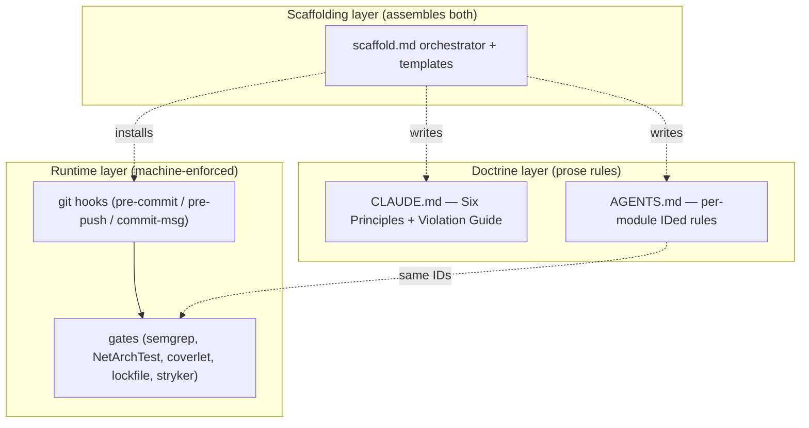

# scaffold-with-guardrails internal docs

## What this is

This document set covers the **scaffold-with-guardrails** skill, also called
**bulletproof-gates** in branch and PR contexts. The system's promise is simple:
neither Claude nor a human can commit code that violates declared architectural
rules without leaving an explicit, auditable trail. It achieves that promise
through three cooperating layers. The **doctrine layer** expresses rules as prose
in `CLAUDE.md` and per-module `AGENTS.md` files — the *why* lives here. The
**runtime layer** enforces those rules mechanically through git hooks, semgrep
scans, NetArchTest assertions, coverage gates, lockfile checks, and mutation
scoring — the *machine says no* lives here. The **scaffolding layer** is the
`scaffold-with-guardrails` skill itself: it reads a completed tech design and
produces a new repo with both doctrine and runtime already wired in. This doc
set is for **humans** maintaining or learning how the skill works — not for
Claude. Claude operates via the skill's own `SKILL.md`, `CLAUDE.md`, and
`AGENTS.md` files and does not need these docs.

---

## Mental model

The dotted lines from Scaffolding mean "produces at scaffold time, not at
runtime" — once a repo is scaffolded the skill is done; the hooks and gates run
on their own from that point forward. The dotted line `AG -.same IDs.-> G`
captures the key invariant: every rule in `AGENTS.md` carries a machine-readable
ID (e.g. `MYAPP-DOMAIN-R001`) that appears verbatim as the semgrep rule ID in
`.semgrep/` and as the NetArchTest test name in `tests/.../Architecture/`. A
single architectural decision is named in exactly three places — prose, static
analysis, and test suite — so there is nowhere for a violation to hide.

---

## Who reads what

| Situation | Read |
|---|---|
| New contributor onboarding | This README + `governance-humans.md` |
| A gate failed on my commit | `gates.md` + `bypass-and-escape-hatches.md` |
| Adding a new architectural rule | `governance-claude.md` + `gates.md` |
| Scaffolding a new project | `scaffolding-flow.md` |
| Wondering why my Claude doesn't notice X | `governance-claude.md` |
| About to bypass a gate | `bypass-and-escape-hatches.md` |

---

## Spoke index

| File | Covers | Est. read |
|---|---|---|
| `gates.md` | What each gate catches, when it runs, how to extend | 15 min |
| `hooks.md` | Dispatcher architecture, `.d/` runners, profiles | 10 min |
| `governance-claude.md` | How Claude is steered: CLAUDE.md, AGENTS.md, NEG-AUDIT, GRILL-LOOP | 20 min |
| `governance-humans.md` | PR template, branch protection, rules audit | 10 min |
| `scaffolding-flow.md` | End-to-end: grill → built repo with gates running | 20 min |
| `bypass-and-escape-hatches.md` | When and how to bypass; audit trail | 8 min |

---

## Glossary

**gate**
A discrete machine-enforced check that blocks a git operation when an
architectural or quality rule is violated. Examples: semgrep rule, NetArchTest
assertion, coverlet threshold, Stryker mutation score.

**hook**
A git lifecycle script (`pre-commit`, `pre-push`, `commit-msg`) that invokes
one or more gates. Hooks are installed into `.claude/hooks/` at scaffold time
and run automatically on every relevant git action.

**dispatcher**
The top-level hook script that reads the active profile and calls individual
runner scripts from the `.d/` directory. It is the single entry point that all
hook types share; individual gates are added or removed by dropping scripts into
`.d/` without touching the dispatcher.

**bypass**
An intentional, documented override that lets a specific commit skip one or more
gates. Bypasses must be accompanied by an audit-trail comment explaining why the
rule does not apply; they are reviewed in the PR diff and surfaced by
`bypass-and-escape-hatches.md`.

**negative audit (NEG-AUDIT)**
A structured checklist run before declaring any skill output complete. For each
of the ten Violations in the Violation Guide, the audit demands a YES/NO answer
with one-line evidence. Any uncorrected NO blocks completion. See
`skills/scaffold-with-guardrails/NEG-AUDIT.md`.

**grill loop**
The interrogation pattern shared by all `*-grill` skills. One question at a
time, each with a recommended answer and rationale; vague deferrals are
rejected; completion is blocked until every open branch in the decision tree is
closed. See `skills/scaffold-with-guardrails/GRILL-LOOP.md`.

**Six Principles**
The six forces in `~/.claude/CLAUDE.md` that push back against software decay:
Anchor (preserve intent), Shield (structural integrity), Filter (narrative
abstraction), Buffer (subsidiarity), Sensor (decipherability), Engine (mechanical
sympathy). Every gate in this system exists to enforce at least one of them.

**Violation**
One of the ten named failure modes in the Violation Guide: Paper Tiger,
Distributed Monolith, Leaky Narrative, Infected Core, Black Box, Computational
Friction, Forensic Coding, God Class / God Method, Fossil Comments, Silent
Fallback. Each Violation is the negation of a Principle. Naming the Violation
determines the fix.

**AGENTS.md**
A per-module markdown file that declares the module's responsibility, allowed
dependencies, and machine-readable architectural rules (IDs of the form
`<APP>-<MODULE>-RXXX`). Claude reads these to understand module scope; the same
IDs link to semgrep rules and NetArchTest tests in the runtime layer.

**CLAUDE.md**
The root governance file placed at the repo root by the scaffolding layer. It
embeds the Six Principles, the Violation Guide, and any project-specific
conventions. Claude reads this on every session start and uses it as the
authoritative source for what "correct" looks like in this repo.

**scaffold orchestrator**
The `scaffold-with-guardrails` skill itself (`SKILL.md` + `templates/`). Given
a completed tech design, it drives `dotnet new` scaffolders, hand-writes
governance files, generates semgrep rules and arch tests for each architectural
rule, and wires hooks — producing a repo where gates are already running before
the first line of business logic is written.

**doctrine**
The prose layer of the system: `CLAUDE.md` and per-module `AGENTS.md` files.
Doctrine records the *why* behind architectural decisions in human-readable form.
It is the source of truth that both Claude (at conversation time) and the runtime
gates (via shared rule IDs) refer back to.
