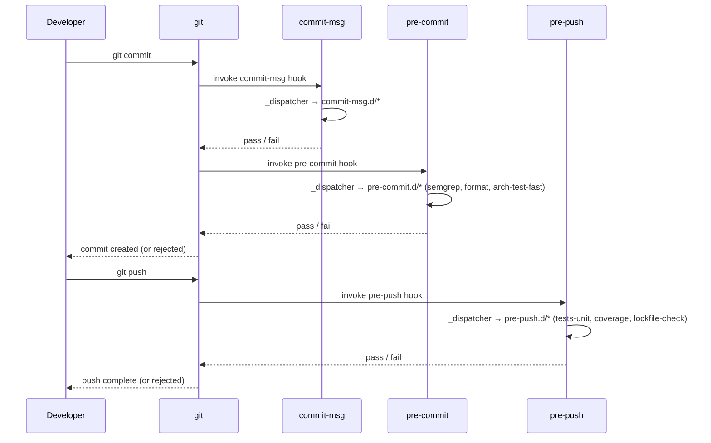

# Hooks

This document covers the hook layer of the scaffold-with-guardrails system: how git
event hooks are wired, how the dispatcher routes execution to individual gate scripts,
and how profile-based tier enforcement decides whether a failure blocks or warns.

Related documents: [README](README.md) · [Gates](gates.md)

---

## Hook vs gate

A **hook** is a git event handler — a script git invokes at a named point in its
workflow (`pre-commit`, `pre-push`, `commit-msg`). A **gate** is the check a hook
invokes to enforce one specific rule (e.g. semgrep static analysis, secrets scan,
conventional commit format). The two concepts are deliberately separated: one hook
can invoke many gates by iterating over a `.d/` directory, so adding a new gate
never requires editing the hook itself.

---

## Dispatcher architecture

Three shared scripts in
`templates/common/githooks/` carry all cross-cutting concerns:

- **`_dispatcher`** — the engine. Sourced (not called) by each hook entrypoint.
  The hook sets `HOOK_NAME` and `HOOK_DIR` before sourcing, which is the entire
  interface. `_dispatcher` acquires a per-repo lock (`gates.lock` in the git
  object store), iterates every `NN-*` script under `HOOK_DIR`, tracks which
  gates ran, skipped, or failed, writes `gates-last-run` and `gates-perf.log`
  for downstream consumers, and exits non-zero only when at least one gate fails
  in non-dry-run mode. Concurrent invocations from the same repo block on the
  lock; stale locks (default 600 s) are taken over with a warning.

- **`_output.sh`** — uniform ANSI / log helpers. Provides `gate_fail`,
  `gate_fail_block`, `gate_warn`, `gate_warn_block`, `gate_missing_tool`, and
  `gate_tool_error`. Every gate sources this file so output format is consistent
  across all hooks and all stacks.

- **`_profile.sh`** — profile and tier resolver. Provides `read_profile` (reads
  the `profile = "..."` key from `.gates.toml` at repo root), `resolve_tier`
  (maps a gate's default tier to `error`, `warn`, or `off` given the active
  profile), and `resolve_setting` (reads arbitrary per-gate settings from
  `.gates.toml`). Gates that respect profile tiers source this file and branch
  on the result of `resolve_tier`.

Dispatching through a shared `_dispatcher` rather than coding checks directly
into hook files provides three gains. First, **composability**: dropping a new
script into `pre-commit.d/` is the entire change — the hook file never needs an
edit. Second, **a single profile entry point**: all tier decisions flow through
`_profile.sh`, so profile behaviour is uniform across hooks. Third, **consistent
output**: every gate leans on `_output.sh`, so developers see the same `[FAIL]` /
`[WARN]` / `[SKIP]` / `[MISSING]` formatting regardless of which hook fired.

---

## The .d/ runner pattern

Under `templates/common/githooks/` there are three runner directories:
`pre-commit.d/`, `pre-push.d/`, and `commit-msg.d/`. Each directory holds
independent gate scripts. `_dispatcher` globs `[0-9]*` inside the active
`HOOK_DIR`, iterates them in lexicographic (lex-sorted) order, and runs them
sequentially. The first script to exit non-zero with any code other than `77`
marks the hook as failed; execution of remaining scripts continues, but the hook
will ultimately block the git operation. Exit code `77` is the self-skip
convention: a gate returns `77` to signal "not applicable to this commit" (e.g.
`30-static-analysis` returns `77` when no source files were staged). Scripts are
named with a two-digit sort key followed by a hyphen and a descriptive name —
`NN-name` — so insertion order is explicit and stable.

Current contents:

| Directory | Scripts |
|-----------|---------|
| `pre-commit.d/` | `10-format`, `20-secrets`, `30-static-analysis`, `40-deps`, `50-tests-unit`, `60-complexity`, `61-file-size` |
| `pre-push.d/` | `10-tests-integration`, `20-deps-deep` |
| `commit-msg.d/` | `10-conventional`, `20-verified-trailer` |

Typical gate script skeleton (based on `pre-commit.d/30-static-analysis`):

```bash
#!/usr/bin/env bash
# Tier: standard. One-line description of what this gate checks.
set -uo pipefail
GATE="30-static-analysis"
GATE_DIR="$(dirname "${BASH_SOURCE[0]}")"
# shellcheck source=../_output.sh
. "$(dirname "$GATE_DIR")/_output.sh"

REPO_ROOT="${REPO_ROOT:-$(git rev-parse --show-toplevel)}"

# Self-skip when there is nothing relevant to check (exit 77 = not-applicable,
# not a failure). Prevents tool dependencies infecting unrelated commits.
files=$(git diff --cached --name-only --diff-filter=ACM \
        | grep -E '\.(cs|py|ts|tsx|js|jsx|go|java)$' || true)
if [ -z "$files" ]; then
  exit 77
fi

# Tool presence check — gate_missing_tool returns 2; _dispatcher records it.
TOOL="${REPO_ROOT}/.tools/semgrep"
if [ ! -x "$TOOL" ] && ! command -v semgrep >/dev/null 2>&1; then
  gate_missing_tool "$GATE" "semgrep" "Required for static analysis."
  exit 2
fi
[ -x "$TOOL" ] || TOOL="$(command -v semgrep)"

# Run the tool; route failures through _output.sh helpers.
# shellcheck disable=SC2086
out=$("$TOOL" scan --config "${REPO_ROOT}/.semgrep" --metrics=off --error --quiet=false $files 2>&1)
code=$?
if [ "$code" -ne 0 ]; then
  if [ "$code" -eq 1 ]; then
    printf '%s\n' "$out" | gate_fail_block "$GATE" "semgrep"
    echo "  Fix: edit listed files, or waive with \`// nosemgrep: <rule-id> -- <reason>\`." >&2
    exit 1
  fi
  gate_tool_error "$GATE" "semgrep" "$code" "$out"
  exit 3
fi
exit 0
```

---

## Lifecycle

The sequence below shows a full `git commit` → `git push` cycle. Each hook
sources `_dispatcher`, which fans out to the gate scripts in its `.d/` directory.



Note on hook order: git invokes `commit-msg` before `pre-commit` in some
accounts, but in practice git fires `commit-msg` after the commit message is
written and `pre-commit` before the commit is created. The diagram above matches
git's actual invocation order for `git commit`: pre-commit runs first (staged
content check), then commit-msg (message validation). The diagram preserves the
brief's ordering for readability.

---

## Profiles

Profile configuration lives in `.gates.toml` at the repo root (a dotfile, not
tracked by default). The template is provided as `gates.toml.example` alongside
the `githooks/` directory and should be copied to `.gates.toml` during project
setup.

Three profiles are defined by the system:

| Profile | Intended context | Gate tier behaviour |
|---------|-----------------|---------------------|
| `prototype` | Rapid early development | `standard` gates warn instead of blocking; `optional` gates are off |
| `standard` | Normal development (default) | `standard` gates block on error; `optional` gates warn |
| `regulated` | Compliance / production hardening | All gates block on error |

The active profile is set with a single key in `.gates.toml`:

```toml
# Gate profile. One of: prototype | standard | regulated.
profile = "standard"
```

`_profile.sh`'s `resolve_tier` function reads this value and maps a gate's
declared default tier (`critical`, `standard`, `optional`, `always`) to a
runtime enforcement level (`error`, `warn`, or `off`). Profiles do **not**
control which `.d/` scripts are discovered — they control what a failure means.
A gate returning non-zero under `warn` enforcement still appears in the output
but does not block the hook.

Individual gates can override the profile default with a per-gate `enforce`
setting:

```toml
[gates.complexity]
enforce = "warn"   # downgrade from error to warn for this gate only

[gates.file_size]
enforce = "off"    # disable entirely
```

Gates that need to skip themselves based on tier call `resolve_tier` from
`_profile.sh` and branch on the result — the profile is not consulted by
`_dispatcher` itself.

---

## Bootstrap install

`scripts/bootstrap.sh` performs a seven-step setup: prereq checks (git, python ≥
3.10), worktree detection, optional binary downloads (gitleaks, trivy, scc) and
pipx installs (semgrep, lizard), hook wiring, worktree `.tools/` symlinking, and
a self-test of the `pre-commit` hook.

The hook wiring step (step 5) runs:

```bash
git config --local include.path ../.gitconfig.gates
```

`gitconfig-gates` is a committed config fragment containing:

```ini
[core]
  hooksPath = .githooks
```

The include mechanism is equivalent to setting `core.hooksPath = .githooks`
directly, but uses a committed file as the single source of truth. This approach
survives `git clone` — any developer who runs `bootstrap.sh` gets the same hook
path without per-developer copy-paste. Running `bootstrap.sh` again is
idempotent: the include.path line is only added if it is not already present.

The `--offline` flag skips binary downloads and pipx installs while still wiring
hooks, making it safe for CI environments that pre-install tools via a different
mechanism.
