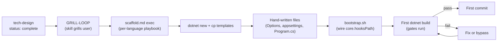

# Scaffolding flow

This document walks the end-to-end path from a completed tech design to a freshly
scaffolded repo where every gate runs on the first `dotnet build`. It names the
moving parts the `scaffold-with-guardrails` skill stitches together — the
prereq check, the per-language playbook, the OWASP filter, the central MSBuild
property files, and the hand-written file inventory — and explains why each
piece exists in the shape it does.

See also: [README](README.md) · [gates.md](gates.md) · [hooks.md](hooks.md) ·
[governance-claude.md](governance-claude.md) ·
[governance-humans.md](governance-humans.md).

---

## End-to-end flow



The flow is intentionally linear with a single back-edge. A run begins after a
tech-design document at `docs/tech-design/<slug>.md` reaches
`status: complete` — that frontmatter is what unblocks the very first node and
prevents the skill from scaffolding off a half-formed design. The skill then
runs its grill loop to fill the remaining gaps (app name, whether a client SDK
is needed, deviations from the default stack), executes the per-language
playbook at `templates/csharp/scaffold.md`, copies the template tree,
hand-writes the files `dotnet new` cannot produce, and finally runs
`bootstrap.sh` to wire `core.hooksPath=.githooks` so the hooks fire on the
*next* git operation rather than needing a per-developer install.

Every step is reversible. The skill is idempotent — re-running it on an
existing repo updates rather than duplicates (the `cp -R src/. dst/`
trailing-slash pattern, `mkdir -p` for every destination, `git init -q` as a
safe no-op on an existing repo). The only branch is the back-edge labelled
"fix or bypass": when the first `dotnet build` fails because a gate fires on
boilerplate the developer has not yet replaced, the developer either fixes the
finding or invokes a documented bypass and loops back to build. The "First
commit" node is the first place where the `Verified:` trailer appears in
`git log`, courtesy of the commit-msg hook installed by `bootstrap.sh` (see
[hooks.md](hooks.md) for the dispatcher and trailer mechanics). From that
point forward, every commit's gate verdict is part of the permanent history
of the repo.

---

## The scaffold.md orchestrator (scaffold orchestrator)

The per-language playbook lives at
`../../../skills/scaffold-with-guardrails/templates/csharp/scaffold.md`. Future
Python and TypeScript scaffolds will land as sibling playbooks under
`templates/python/scaffold.md` and `templates/typescript/scaffold.md`; each
encodes the exact bash sequence and the decision points for its stack. The
skill itself is small — it locates the right playbook, asks the grill
questions at the top of that playbook, then executes the bash block step by
step. The playbook is the source of truth for what gets scaffolded; the skill
is the runner. This split is deliberate. A new language stack should be
addable by writing one new `scaffold.md` and dropping it into `templates/<lang>/`
— if the playbook drifted into the skill itself, every stack would need a code
change to the skill.

The playbook is also written for idempotent re-runs. Every directory creation
uses `mkdir -p` (no failure if the directory already exists). Every directory
copy uses the trailing-slash pattern `cp -R src/. dst/` rather than the bare
`cp -R src dst` form — bare `cp -R` on macOS nests `src` *inside* `dst` on a
re-run, producing artefacts like `.githooks/githooks/...` that the skill never
notices. `git init -q` is run unconditionally; on a fresh directory it
initialises the worktree, on an existing repo it reinitialises the same `.git`
directory with no effect on history. The result is that re-running the skill
on a scaffolded repo refreshes templates without producing duplicates. The
failure mode of a non-idempotent scaffold (silently doubled `cp -R` trees)
is exactly the kind of **Black Box** that surfaces only when a downstream
gate trips on the duplicate.

---

## PREREQ-CHECK

Source: `../../../skills/scaffold-with-guardrails/PREREQ-CHECK.md`.

Before any scaffolding command runs, the skill executes the prereq check
defined in `PREREQ-CHECK.md`. The check has two halves. The first half is
*explicit*: for each entry in the skill's declared Inputs (in
`SKILL.md`), open the file at the canonical path, parse the YAML frontmatter,
and verify `status` matches the expected value. The canonical paths for this
skill are `docs/requirements/<slug>.md` (requirements doc) and
`docs/tech-design/<slug>.md` (tech-design doc). If
`docs/tech-design/<slug>.md` is not `status: complete`, the skill halts and
asks the user to finish the upstream session before continuing. That halt is
the gate at the top of the [end-to-end flow](#end-to-end-flow): the
`status: complete` arrow exists because the prereq check enforces it, not
because the diagram says so.

The second half is *silent*: regardless of prereq state, the skill scans the
repo for `CONTEXT.md`, `docs/adr/*.md`, recent commits
(`git log --oneline -20`), and any existing `AGENTS.md` files. Findings from
the silent scan are not announced unless they conflict with something the user
later says — the goal is for the skill to come into the conversation already
oriented to the repo's tone and existing decisions, not to monologue a status
report. The check also handles the resume case: when the skill's own output
file already exists with `status: in-progress`, the skill prompts whether to
resume from the deferred items in frontmatter or start fresh with a new slug;
when it exists with `status: complete`, the skill prompts to overwrite (with
explicit confirmation) or pick a new slug. The resume path matters because
the grill loop can be long and the alternative — silently starting over —
would discard every decision the user already made while returning a
fake-fresh session, a **Silent Fallback** dressed as convenience. The
prompt converts that swallowed state into an explicit choice.

---

## Options-validation triad

The skill hand-writes typed options classes under
`src/<App>.{Api,Service}/Configuration/*Options.cs` and wires them at host
startup using a three-call pattern:

```csharp
builder.Services
    .AddOptions<DatabaseOptions>()
    .Bind(builder.Configuration.GetSection(DatabaseOptions.SectionName))
    .ValidateDataAnnotations()
    .ValidateOnStart();
```

Each call does one thing and the order is load-bearing. `AddOptions<T>()`
registers the options type. `Bind(...)` populates it from the named
configuration section. `ValidateDataAnnotations()` activates attribute-based
validation (`[Required]`, `[Range]`, `[Url]` on the options properties).
`ValidateOnStart()` moves validation from "first time something resolves
`IOptions<T>`" to "host startup", so a missing or invalid value aborts the
process at boot rather than ten minutes later when a customer's request
finally hits the code path that needed it. Failing fast at process start beats
a `KeyNotFoundException` at a customer; the alternative — discovering missing
configuration during the first real request — is **Silent Fallback** dressed
as lazy initialisation, because by the time it surfaces the deployment is
already serving traffic and the dashboards say "healthy".

`ValidateOnStart()` is unforgiving by design, and that creates one trap the
scaffold defuses up front. If the host has no
`appsettings.Development.json` populated with a matching section for each
options class, the very first `dotnet run` aborts before the host can show
what is missing — and the developer sees a stack trace from
`OptionsValidationException` instead of a working `/health` endpoint. The
fix is to populate a placeholder `appsettings.Development.json` at scaffold
time with one section per options class. The scaffold does this explicitly
in the hand-written files list: see
`../../../skills/scaffold-with-guardrails/templates/csharp/scaffold.md`
under the "Companion settings" treatment. Without the companion JSON the
scaffold would be a **Paper Tiger** — it meets the literal spec (a buildable
repo) but fails the actual need (the developer's first `dotnet run` shows a
working `/health` endpoint, not an `OptionsValidationException` stack trace
that looks identical to a broken scaffold). The companion JSON is the
smallest change that lets the developer see a green first run and *then*
fail-fast on real misconfiguration later.

---

## OWASP semgrep filter

The skill vendors the full `owasp-top-ten.yaml` pack into
`templates/common/semgrep-packs/`. With the pack on disk, every gate run
reads from the local filesystem; no semgrep registry round-trip is required;
and the rule set is deterministic across networks, airplane modes, and
outages of the upstream registry. A scaffold that depended on a live
registry pull would fail the **Buffer** Principle's Airplane Test by
definition — the core (the gate verdict) would depend on a specific piece
of infrastructure (the semgrep registry) that has no business being in the
hot path.

The pack ships with rules for 25 languages — 544 rules in total, weighing in
at roughly 1.3 MB on disk. Of those, only a small subset is relevant to a
C# repo: rules tagged `csharp`, `C#`, `generic`, `yaml`, `dockerfile`,
`regex`, `json`, or `bash`. At scaffold time, the playbook runs a small
Python step that reads the vendored pack, keeps only rules whose `languages`
field intersects that KEEP set, and writes the filtered pack to
`.semgrep/packs/owasp-top-ten.yaml` in the target repo. The result is 77
C#-applicable rules and a pack size of roughly 190 KB. Semgrep no longer
loads 467 inert rules for Python, Java, Go, PHP, Ruby, Scala, Kotlin, Swift,
Clojure, Solidity, HCL, Terraform, and HTML on every gate run.

Two design choices in that step are worth naming. First, the filtering
happens at scaffold time, not by pre-trimming `templates/common/`. Keeping
the full pack in `common/` preserves it as the single source of truth; each
language scaffold derives its own subset. When the Python scaffold lands it
will use the same vendored file with a different KEEP set, and the C# repo
remains unaffected. Mutating `common/` per language would couple them in a
**Distributed Monolith** way — a Python-driven trim would silently shrink
the C# rule set. Second, the Python step imports `yaml` from PyYAML, which
is not part of the standard library. The playbook guards the import with
`python3 -c 'import yaml'` and installs PyYAML via `pip3 install --user`
when it is missing, then exits with an actionable message if the install
fails. A bare `ModuleNotFoundError: No module named 'yaml'` mid-scaffold is
a **Black Box** failure for the developer running the skill; the guard
converts it into a one-line install or a clear error.

---

## Directory.Build.props + Directory.Packages.props

The scaffold copies two MSBuild property files to the repo root verbatim from
`templates/csharp/`. They are short, but every property in them exists to
prevent a specific failure mode at build, restore, or test time.

`Directory.Build.props` applies to every project under the root unless
overridden. The properties it sets:

- **`LangVersion=latest`, `Nullable=enable`, `ImplicitUsings=enable`,
  `EnforceCodeStyleInBuild=true`, `AnalysisLevel=latest-recommended`** — the
  baseline: latest C# language features, nullable reference types on,
  implicit usings on, code style violations promoted to build errors, the
  recommended analysis level for the SDK. Setting these centrally rather
  than per-project prevents the drift where one new project is generated
  without nullable annotations and the rest of the repo carries it forever
  as a **Forensic Coding** entry.
- **`RestorePackagesWithLockFile=true`** — commits a `packages.lock.json`
  beside every project, recording the resolved package graph at restore
  time.
- **`RestoreLockedMode=true` scoped to CI only** via
  `Condition="'$(CI)' == 'true'"` — enforces the lockfile in CI, leaves
  local restores unconstrained. This split keeps local development
  unblocked when a developer is intentionally bumping a dependency, while
  CI refuses to merge a PR whose lockfile does not match the project
  graph. The alternative — `RestoreLockedMode=true` everywhere — would
  block the developer's `dotnet add package` workflow with NU1004 every
  time they tried to update a version, training them to silence the gate.
  For the gate-side view of what NU1004 looks like in CI, see
  [gates.md](gates.md) under the lockfile-mode gate.
- **`WarningsNotAsErrors=$(WarningsNotAsErrors);NU1507`** — NU1507 fires
  when a restore sees multiple NuGet sources without source-mapping
  configured. That is an environment quirk of corporate networks with a
  private feed *and* nuget.org, not a code defect. Promoting it to a
  warning repo-wide keeps CI (single source) unaffected and stops local
  dev (multiple feeds) from being blocked on a configuration issue
  outside the repo.
- **`TreatWarningsAsErrors=true` scoped to `src/` only** via
  `Condition="$(MSBuildProjectDirectory.Replace('\','/').Contains('/src/')) And !$(MSBuildProjectName.EndsWith('.Tests')) And !$(MSBuildProjectName.Contains('.Tests.'))"`
  — production code under `src/` is held to a hard line; test projects
  (`.Tests` or `.Tests.*`) get a softer setting because test assemblies
  legitimately tolerate things like unused parameters in fixtures and
  intentionally-suppressed compiler hints. The path match normalises `\`
  to `/` to avoid a false negative on Windows, and the substring boundary
  `/src/` (rather than bare `src`) prevents a future folder named
  `src-utils` from being accidentally caught.
- **`InvariantGlobalization=true` for `*.Api` and `*.Service` hosts** via
  `Condition="$(MSBuildProjectName.EndsWith('.Api')) Or $(MSBuildProjectName.EndsWith('.Service'))"`
  — host processes run with the invariant culture by default, so tests
  and runtime behaviour do not depend on the locale of the box the
  process happens to be running on. Locale-dependent test flakes
  (different date formats, different decimal separators, different case
  folding) are a textbook **Black Box**: green on the developer's machine,
  red on a CI runner in a different region, with no signal in the failure
  to suggest culture is the cause. Turning on the invariant culture at
  the host level removes the class of flake at the source.

`Directory.Packages.props` enables central package management
(`ManagePackageVersionsCentrally=true`) and pins every package version the
scaffolded repo uses. The pins (verbatim from the file):

- `MediatR 12.4.1` — last MIT release before the August 2024 commercial
  pivot. Pin until a license review approves an upgrade.
- `MassTransit 8.3.4` and `MassTransit.RabbitMQ 8.3.4` — last MIT v8
  releases before the commercial v9. Pin until a license review approves
  an upgrade.
- `CSharpFunctionalExtensions 3.6.0`, `Dapper 2.1.66`, `Npgsql 8.0.5`,
  `Microsoft.Extensions.Hosting 9.0.7`, `NetArchTest.Rules 1.3.2`,
  `Microsoft.AspNetCore.OpenApi 9.0.7`,
  `Swashbuckle.AspNetCore.SwaggerUI 10.1.7`,
  `Microsoft.NET.Test.Sdk 17.12.0`, `xunit 2.9.2`,
  `xunit.runner.visualstudio 2.8.2`, `coverlet.collector 6.0.2`.

The non-license pins exist for a different reason: `dotnet new webapi`,
`dotnet new worker`, and `dotnet new xunit` all emit project files that
reference these package IDs with explicit `Version="..."` attributes. The
scaffold strips those Version attributes after `dotnet new` runs (see the
`sed -i.bak 's/ Version="[^"]*"//g'` step in the playbook), because under
`ManagePackageVersionsCentrally=true` an inline Version is an NU1008 error.
Strip without a corresponding central pin and the project no longer resolves
at all. So every ID that `dotnet new` emits with a Version *must* be pinned
centrally for the strip step to land the repo in a buildable state. That
coupling is why this list is longer than the license-driven pins — the IDs
are not chosen for taste, they are forced by what the templates emit.

Together the two files do four things the rest of the repo silently relies
on: they prevent **untracked upgrades** (every version is in source control),
they prevent **lockfile drift** (CI refuses out-of-sync graphs), they
prevent **locale-dependent test flakes** (invariant culture on hosts), and
they prevent **NU1008 errors after the Version-strip** (every stripped ID
has a central pin to fall back to).

---

## Hand-written files inventory

After `dotnet new` finishes, the skill hand-writes every file the
generators do not produce. The canonical, ground-truth list lives at
`../../../skills/scaffold-with-guardrails/templates/csharp/scaffold.md`
under the "Files the skill hand-writes after dotnet new" section. Refer
to that section as the authoritative inventory; this document categorises
those files by the role they play in the running system.

**Identity files** — the doctrine layer.

- `CLAUDE.md` at the repo root, generated from `CLAUDE-MD-TEMPLATE.md` with
  the Six Principles and Violation Guide embedded inline. Scaffolded repos
  are self-contained; they do not assume the user's global `CLAUDE.md` is
  present.
- `src/<App>.<Layer>/AGENTS.md`, one per layer, generated from
  `AGENTS-MD-TEMPLATE.md`. The layer count includes `<App>.Client` when
  the client SDK is scaffolded — the SDK is a public-surface boundary and
  gets its own `AGENTS.md` describing its contract-stability rules.

**Gate files** — the runtime layer, machine-enforced.

- `Directory.Build.targets` at the repo root, wiring the semgrep gate into
  every `dotnet build` via a `SemgrepLint` target that runs before `Build`.
- `.semgrep/<app-lower>/` with one YAML per cross-cutting concern
  (`security.yaml`, `quality.yaml`, `async.yaml`, `dapper.yaml`) and one
  YAML per architectural layer (Domain, Application, Infrastructure,
  Persistence, Api, Service, plus Client when scaffolded).
- `tests/<App>.Tests.Unit/Architecture/<Layer>ArchitectureTests.cs`, one
  per layer, anchoring NetArchTest assertions against that layer's
  `AssemblyMarker`.
- `.github/PULL_REQUEST_TEMPLATE.md`, copied from
  `templates/common/.github/PULL_REQUEST_TEMPLATE.md` — the human-side
  governance loop that pairs with the machine gates (see
  [governance-humans.md](governance-humans.md)).

**Runtime files** — what makes the host actually boot.

- A canonical `Program.cs` for each host, replacing the stripped
  weather-forecast boilerplate `dotnet new webapi` emits. The skeleton
  wires `/` (a smoke-test landing endpoint that returns the machine name
  and links to the other three routes), `/health`, `/openapi/v1.json`
  (gated to Development), and `/swagger` (also Development-only). Enough
  surface for a `curl /` to confirm the host boots, options bind, and
  the Kestrel routing table is alive.
- `src/<App>.{Api,Service}/Configuration/*Options.cs`, one file per
  options group, defining the typed options classes the
  [Options-validation triad](#options-validation-triad) wires up.
- `src/<App>.{Api,Service}/appsettings.Development.json`, populated with
  the matching configuration section for every options class so
  `ValidateOnStart` does not abort startup on the first `dotnet run`.

**AssemblyMarker files** — one per layer, required by NetArchTest.

- `src/<App>.<Layer>/AssemblyMarker.cs`, an otherwise-empty class whose
  only job is to give the architecture tests a stable type to anchor
  `typeof(...).Assembly` against. NetArchTest needs an assembly
  reference per layer it asserts on; the marker is how the test
  acquires that reference without a brittle string lookup. The layer
  count includes `<App>.Client` when scaffolded, so the architecture
  tests can assert that nothing in the client SDK references
  Infrastructure or Persistence.

The combined effect of these four categories is the scaffold's central
promise: the moment the first `dotnet build` completes, every gate that
will ever run on this repo is already wired and firing. There is no
"and then we add the gates later" step. The runtime layer is configured
before the first commit, the doctrine layer is in place to drive
reviewers and Claude, and the assembly markers and configuration files
make sure both layers can do their work without a `KeyNotFoundException`
or a missing-assembly error masking a real violation as a build break.
