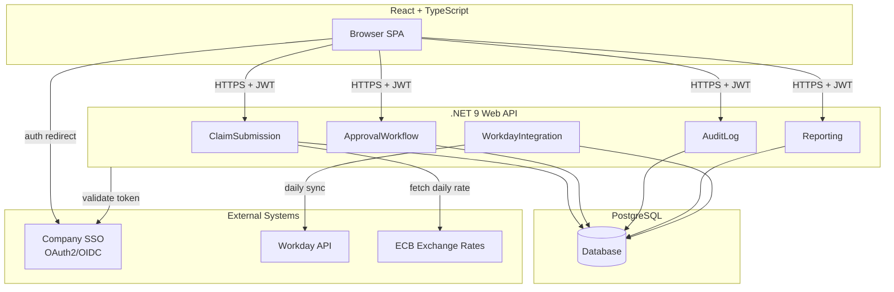
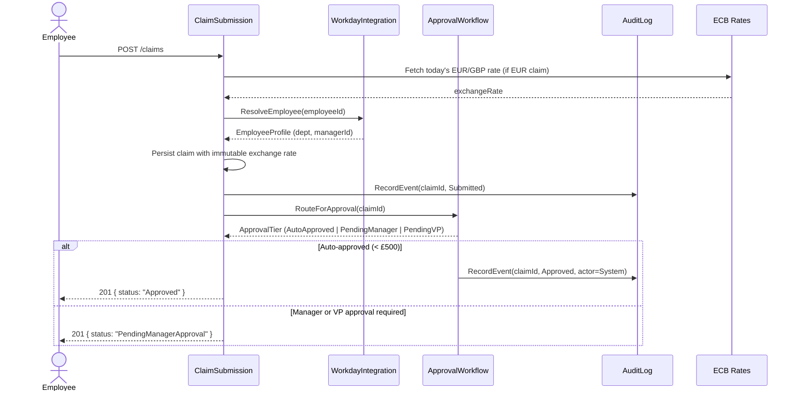
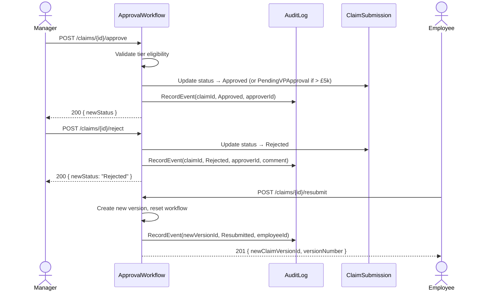
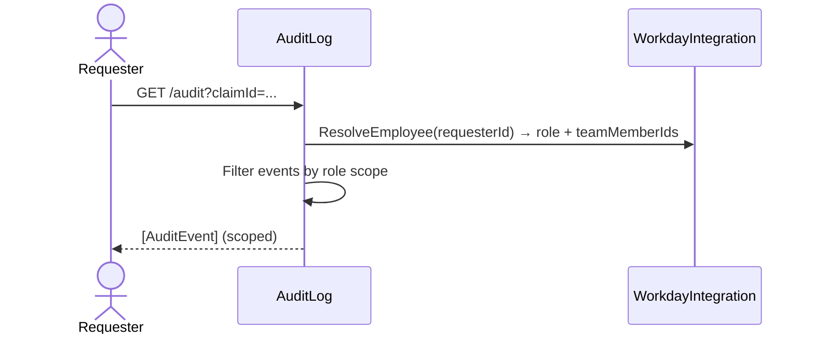
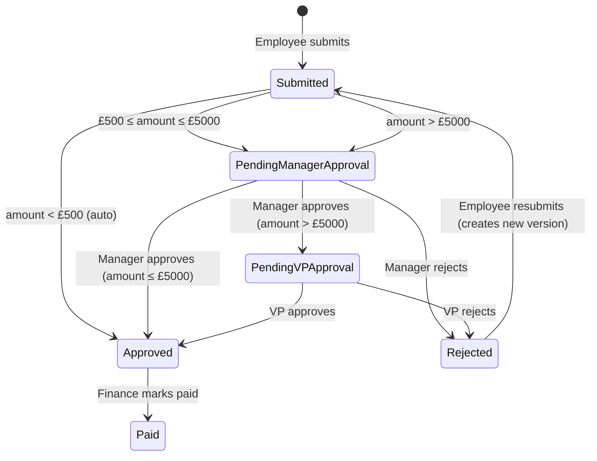
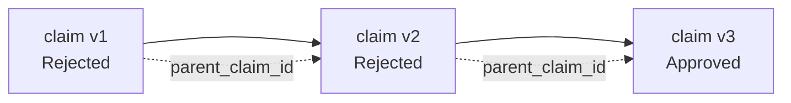

# Tech Design — Expense Reimbursement Portal

## Architecture overview

The portal is a web application with a React + TypeScript frontend talking to a C# / .NET 9 Web API backend over HTTPS. The backend is organised into five bounded components — ClaimSubmission, ApprovalWorkflow, AuditLog, Reporting, and WorkdayIntegration — each with a clear responsibility and a domain-language interface. All persistent state lives in a single PostgreSQL database accessed through Entity Framework Core. Authentication delegates to the company SSO via OAuth2/OIDC; the app receives a validated JWT and resolves role and org-hierarchy context from it. Workday is the system of record for employee, manager, and VP relationships; the portal syncs a daily snapshot and degrades gracefully if Workday is unreachable. Deployment is Docker containers on Kubernetes with blue-green rollout.



## Context boundaries

**Inside the app:** Claim submission, approval routing, rejection and resubmission with version history, payment status tracking, audit log with role-based visibility, spend reporting, and manager dashboard for pending approvals.

**Outside the app:** Employee and organisational hierarchy data (Workday — consumed read-only via daily sync), authentication and identity (company SSO — consumed via OAuth2/OIDC token validation), exchange rate data (ECB daily rates — consumed at submission time), payment execution (Finance initiates payment in downstream system; this portal tracks status only — GL integration is explicitly out of scope).

## Components

### ClaimSubmission

- **Responsibility:** Accepts new claims from employees, enforces currency and exchange-rate capture, applies threshold routing logic, and tracks payment status through the claim lifecycle.
- **Owns:** Claim records, claim line items, receipt attachments, submission-time exchange rates, current claim status.
- **Depends on:** WorkdayIntegration (to resolve submitting employee's department and manager), AuditLog (to record submission event), ApprovalWorkflow (hands off after creation for routing).
- **Exposes:**
  - `SubmitClaim(employeeId, lineItems, currency, receipts) → ClaimId`
  - `GetClaim(claimId) → ClaimDetail`
  - `ListMyClaims(employeeId, filters) → [ClaimSummary]`
  - `RecordPayment(claimId, paidAt) → void` *(Finance only)*

### ApprovalWorkflow

- **Responsibility:** Routes each claim through the correct approval tier based on GBP-equivalent amount, records approver decisions and comments, and manages resubmission versioning.
- **Owns:** Approval decisions, rejection comments, workflow state per claim version, version lineage.
- **Depends on:** WorkdayIntegration (to resolve approver identity and VP for a given employee), AuditLog (to record approval/rejection events), ClaimSubmission (reads claim amount and status to determine routing).
- **Exposes:**
  - `RouteForApproval(claimId) → ApprovalTier`
  - `ApproveClaim(claimId, approverId) → void`
  - `RejectClaim(claimId, approverId, comment) → void`
  - `ResubmitClaim(claimId, employeeId, edits) → NewClaimVersionId`
  - `GetVersionHistory(claimId) → [ClaimVersion]`

### AuditLog

- **Responsibility:** Records every state transition immutably with actor, timestamp, and reason; enforces role-scoped visibility so Finance sees all events, managers see their team's events, and employees see only their own.
- **Owns:** Immutable audit event records.
- **Depends on:** WorkdayIntegration (to resolve role and team membership for scoped queries).
- **Exposes:**
  - `RecordEvent(claimId, actorId, eventType, reason?) → void`
  - `QueryLog(requesterId, filters) → [AuditEvent]` *(scoped by role)*

### Reporting

- **Responsibility:** Serves Finance's spend reports (by department and category, any date range, CSV export) and the manager's pending-approvals dashboard.
- **Owns:** No authoritative data — reads from claims and audit records. Owns query definitions and export formatting.
- **Depends on:** ClaimSubmission (claim data), ApprovalWorkflow (pending approval state), WorkdayIntegration (department hierarchy for spend aggregation).
- **Exposes:**
  - `GenerateSpendReport(dateRange, groupBy) → ReportExport` *(Finance only)*
  - `GetPendingApprovalsForManager(managerId, filters) → [PendingClaimSummary]`

### WorkdayIntegration

- **Responsibility:** Maintains a daily-refreshed local snapshot of employee, manager, and VP relationships from Workday so the rest of the system can resolve org hierarchy without coupling to Workday availability.
- **Owns:** Employee snapshot (name, department, manager, VP chain). Source of record remains Workday; this component owns the cached copy.
- **Depends on:** Workday API (external).
- **Exposes:**
  - `ResolveEmployee(employeeId) → EmployeeProfile`
  - `ResolveApproverChain(employeeId) → ApproverChain`
  - `ResolveDepartment(employeeId) → DepartmentId`

## Responsibility matrix

| Component | Owns | Reads from | Writes to |
|-----------|------|------------|-----------|
| ClaimSubmission | Claim, LineItem, Receipt, ExchangeRate, ClaimStatus | WorkdayIntegration (employee/dept) | DB: claims, line_items, receipts; AuditLog |
| ApprovalWorkflow | ApprovalDecision, RejectionComment, ClaimVersion | ClaimSubmission (amount/status), WorkdayIntegration (approver chain) | DB: approval_decisions, claim_versions; AuditLog |
| AuditLog | AuditEvent | WorkdayIntegration (role/team) | DB: audit_events |
| Reporting | — (query-only) | ClaimSubmission, ApprovalWorkflow, WorkdayIntegration | — (export only) |
| WorkdayIntegration | EmployeeSnapshot | Workday API (external, daily) | DB: employee_snapshots |

## Data model

All tables in PostgreSQL. EF Core for migrations and query. UUIDs as primary keys throughout (no leaking of sequential IDs to clients).

### claims
```
id              UUID        PK
employee_id     UUID        FK → employee_snapshots.id
version_number  INT         default 1
parent_claim_id UUID        nullable FK → claims.id (for resubmissions)
status          ENUM        (Submitted | PendingManagerApproval | PendingVPApproval | Approved | Rejected | Paid)
total_amount_original   DECIMAL(12,2)
original_currency       CHAR(3)      (GBP | EUR)
exchange_rate_to_gbp    DECIMAL(10,6)
total_amount_gbp        DECIMAL(12,2) computed at submission
submitted_at    TIMESTAMPTZ
updated_at      TIMESTAMPTZ
```

### line_items
```
id          UUID    PK
claim_id    UUID    FK → claims.id
description TEXT
category    TEXT
amount      DECIMAL(10,2)
currency    CHAR(3)
```

### receipts
```
id          UUID    PK
claim_id    UUID    FK → claims.id
storage_key TEXT    (object storage reference)
uploaded_at TIMESTAMPTZ
```

### approval_decisions
```
id          UUID    PK
claim_id    UUID    FK → claims.id
approver_id UUID    FK → employee_snapshots.id
tier        ENUM    (Manager | VP)
decision    ENUM    (Approved | Rejected)
comment     TEXT    nullable
decided_at  TIMESTAMPTZ
```

### audit_events
```
id          UUID    PK
claim_id    UUID    FK → claims.id
actor_id    UUID    FK → employee_snapshots.id
event_type  ENUM    (Submitted | Approved | Rejected | Resubmitted | Paid)
reason      TEXT    nullable
occurred_at TIMESTAMPTZ
```
*Insert-only. No UPDATE or DELETE ever issued against this table.*

### employee_snapshots
```
id              UUID    PK
workday_id      TEXT    UNIQUE
full_name       TEXT
email           TEXT
department_id   TEXT
manager_id      UUID    nullable FK → employee_snapshots.id
vp_id           UUID    nullable FK → employee_snapshots.id
synced_at       TIMESTAMPTZ
```
*Replaced in full on each daily sync. Historical claims carry employee_id pointing to the snapshot that was current at submission; snapshots are never deleted — anonymised per GDPR retention rules after 7 years.*

**Retention:** Claims and audit events are retained for 7 years. Deleted/departed employee records are anonymised (name, email replaced with synthetic tokens) rather than removed, preserving referential integrity of the audit trail.

**Indexes:** `claims(employee_id, status)`, `claims(status, submitted_at)` for dashboard queries; `audit_events(claim_id, occurred_at)` for log queries; `claims(submitted_at, status)` for spend report date-range scans.

## API contracts

### ClaimSubmission public surface

```
POST   /claims
  Body:  { currency: "GBP"|"EUR", lineItems: [{description, category, amount}], receiptIds: [UUID] }
  → 201  { claimId: UUID, status: "Submitted"|"Approved", exchangeRateToGbp: decimal }
  → 422  { error: "ValidationFailure", fields: [...] }

GET    /claims/{claimId}
  → 200  ClaimDetail { id, status, totalAmountOriginal, originalCurrency, exchangeRateToGbp, totalAmountGbp, lineItems, receipts, submittedAt }
  → 403  if requester has no visibility of this claim
  → 404  if not found

GET    /claims?employeeId=&status=&page=&pageSize=
  → 200  { items: [ClaimSummary], total, page, pageSize }

POST   /receipts/upload
  Body:  multipart form data
  → 201  { receiptId: UUID }

PATCH  /claims/{claimId}/status
  Body:  { status: "Paid", paidAt: ISO8601 }   — Finance only
  → 200  { claimId, status }
  → 403  if not Finance role
```

### ApprovalWorkflow public surface

```
POST   /claims/{claimId}/approve
  Body:  { approverId: UUID }
  → 200  { claimId, newStatus }
  → 409  if claim is not in an approvable state for this approver tier

POST   /claims/{claimId}/reject
  Body:  { approverId: UUID, comment: string }
  → 200  { claimId, newStatus: "Rejected" }
  → 409  if claim is not in a rejectable state

POST   /claims/{claimId}/resubmit
  Body:  { employeeId: UUID, lineItems: [...], receiptIds: [...] }
  → 201  { newClaimVersionId: UUID, versionNumber: int }
  → 409  if claim is not in Rejected state

GET    /claims/{claimId}/versions
  → 200  [{ versionNumber, status, submittedAt, rejectionComment? }]
```

### AuditLog public surface

```
GET    /audit?claimId=&actorId=&eventType=&from=&to=&page=&pageSize=
  → 200  { items: [AuditEvent { id, claimId, actorId, eventType, reason, occurredAt }], total }
  — Scoped server-side: Finance sees all; managers see team claims; employees see own claims
  → 403  if requester has no visibility of any matching records
```

### Reporting public surface

```
GET    /reports/spend?from=YYYY-MM&to=YYYY-MM&groupBy=department|category
  — Finance only
  → 200  application/json  { rows: [{ groupKey, totalGbp, claimCount }] }
  Accept: text/csv → CSV export

GET    /dashboard/pending-approvals?managerId=&status=&sortBy=amount|submittedAt&order=asc|desc&page=&pageSize=
  → 200  { items: [PendingClaimSummary { claimId, employeeName, category, submittedAt, totalAmountGbp, status }], total }
  → 403  if requester is not a manager
```

## Integration points

| System | Direction | Protocol | Auth |
|--------|-----------|----------|------|
| Company SSO | Inbound (token validation) | OAuth2/OIDC (JWT) | OIDC client credentials |
| Workday API | Outbound (daily read) | REST/HTTPS | OAuth2 service account |
| ECB Exchange Rates | Outbound (daily read) | HTTPS | None (public API) |
| Object Storage (receipts) | Outbound (read/write) | HTTPS (presigned URL pattern) | Service account key |

## Key flows

### Claim submission (FR-001, FR-002)



### Manager approval / rejection (FR-003, FR-004)



### Audit log query (FR-006)



## Supporting diagrams

### Claim status state machine



### Version lineage



## Tech stack

| Layer | Choice | Rationale |
|-------|--------|-----------|
| Frontend | React + TypeScript | Stated constraint; component model suits dashboard + form-heavy UI |
| Backend | C# / .NET 9 Web API | Stated constraint; strong async/await, EF Core, and OpenTelemetry support |
| Database | PostgreSQL | See ADR-0001; relational model fits structured claims and reporting queries |
| ORM | Entity Framework Core | Natural .NET choice; code-first migrations; avoids raw SQL for routine queries |
| Auth | Company SSO via OAuth2/OIDC | Stated constraint; JWT validation in middleware; roles derived from token claims |
| Exchange rates | ECB daily rates | Free, authoritative, no vendor risk; rate recorded immutably at submission |
| Deployment | Docker + Kubernetes | Stated constraint; enables blue-green rollout and horizontal pod autoscaling |
| Observability | Serilog (structured logs) + OpenTelemetry | Stated constraint; trace context propagated across components; Grafana dashboards |

## NFRs

| Concern | Target | How enforced |
|---------|--------|--------------|
| Response time | P95 < 2 s for all user-facing endpoints | Grafana/OTel P95 latency alert; slow-query log on PostgreSQL; index coverage reviewed before release |
| Availability | 99.5% uptime | Blue-green deployment eliminates downtime deploys; Kubernetes pod restarts on failure; health-check endpoints on each API pod |
| Data retention | Claims retained 7 years | PostgreSQL retention policy + scheduled anonymisation job; no hard deletes on claims or audit events |
| GDPR | Personal data handled per policy | Anonymisation-not-deletion on departure/7-year threshold; data minimisation in Workday snapshot (no PII beyond name, email, department) |
| Workday degradation | Portal remains usable if Workday is unreachable | Daily snapshot cached in DB; stale-but-usable fallback; staleness surfaced in UI after 24 h |
| Exchange rate freshness | Rate current to submission day | ECB rate fetched and cached daily; if ECB unreachable at submission, use previous day's cached rate and log warning |

## Constraints register

| ID | Constraint | Source | Impact |
|----|-----------|--------|--------|
| C-001 | Must integrate with Workday for org hierarchy | Requirements | WorkdayIntegration component; daily sync architecture |
| C-002 | Must comply with GDPR | Requirements | Anonymisation-not-deletion; data minimisation in snapshot |
| C-003 | 3-month delivery timeline | Requirements | Scope strictly limited to 8 FRs; no GL integration, no mobile app |
| C-004 | Claims submitted via portal only after go-live | Requirements | No legacy import path needed; migration of historical records is out of scope |
| C-005 | No General Ledger integration | Requirements (out of scope) | Finance marks claims Paid manually; portal tracks status only |

## Risks & mitigations

| ID | Risk | Severity | Mitigation |
|----|------|----------|-----------|
| R-001 | Workday API unreliable or unavailable | Medium | Cache employee snapshot daily in DB; degrade gracefully using cached data; surface staleness to user after 24 h |
| R-002 | ECB exchange rate source unavailable at submission time | Low | Cache previous day's rate in DB; use cached rate as fallback; log warning to Serilog + OTel; rate is still recorded immutably |
| R-003 | Large claim volume degrades reporting queries | Low | Date-range and status indexes; Reporting uses read-optimised queries; horizontal pod scaling if needed |
| R-004 | Workday org hierarchy changes between claim submission and approval | Low | Approval routing uses approver chain resolved at submission time and stored on claim; late-breaking hierarchy changes do not reroute in-flight claims |

## ADRs

- [ADR-0001](../adr/0001-expense-portal-postgresql.md) — Use PostgreSQL over an event store

## Operations

- **Deploy:** Blue-green deployment on Kubernetes. New version deployed to green slot; traffic switched atomically; rollback by switching back to blue. Zero-downtime database migrations via EF Core migration scripts applied before traffic cut-over.
- **Monitor:** Grafana dashboards on P95 latency per endpoint and error rate per component. Serilog structured logs shipped to log aggregation. OpenTelemetry traces with trace context propagated across component boundaries. Alerts: P95 > 2 s for any user-facing endpoint; error rate > 1% over 5-minute window; Workday sync failure; ECB rate fetch failure.
- **Scale:** Horizontal pod autoscaling on the API layer (CPU and request-queue depth signals). PostgreSQL connection pooling via PgBouncer. Reporting queries isolated to read replica if query volume warrants it (not provisioned at launch; deferred until R-003 materialises).
